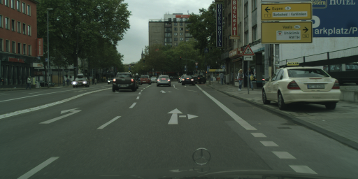
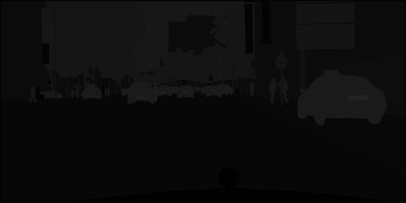

# Semantic Segmentation using Fully Convolutional Networks

## Introduction
In this project, we demonstrate one of the approaches to semantic
scene understanding in the problem domain of self-driving car perception.

At the moment there are two state of the art approaches, both using convolutional
neural networks. One is based on
detecting bounding boxes around objects of interest (like YOLO and SSD) and
classifying them. The other approach is semantic segmentation using
Fully Convolutional Network (FCN) where each pixel
of an image is classified into one of the relevant classes like 'driveable road space',
'other vehicles', 'pedestrians', 'buildings' etc.

Bounding box detector approach is faster, but does not give quite as valuable
answers. For example: how would you draw a bounding box around driveable road space?
The FCN approach is slower, but gives quite precise regions of interest
in segmented image to be used directly in perception/planning pipelines of
an autonomous vehicle.

In this work we implement FCN approach using [paper by Shelhamer, Long
and Darrell](https://arxiv.org/pdf/1605.06211.pdf).
Their code can be found [here](https://github.com/shelhamer/fcn.berkeleyvision.org)

## Data Set: Cityscapes

Good labeled datasets are vital to success of supervised learning tasks.
For the task at hand we chose [Cityscapes dataset](https://www.cityscapes-dataset.com)
which provides detailed labeled examples of road scene images
from 50 German cities, across all seasons, just daytime in moderate/good
weather conditions. It has fine ground truth labels for 35 classes of
various classes of objects
in the scene relevant for tasks of autonomous vehicle perception.

The data need to be downloaded. In this work we use
gtFine_trainvaltest.zip (241MB) and leftImg8bit_trainvaltest.zip (11GB)
files.
The
[provided code](https://github.com/mcordts/cityscapesScripts) was used to
pre-process the data.
In particular we have changed `helpers/labels.py` to use all labelled classes
(`cityscape_labels.py` in this repo is same version of code.)
And we have run `preparation/createTrainIdLabelImgs.py` to generate
ground truth images for updated labels.

Our final cityscapes data tree looks like this:
```
cityscapes
├── README.md
├── cityscapesscripts
│   ├── __init__.py
│   ├── annotation
│   │   ├── cityscapesLabelTool.py
...
│   ├── evaluation
│   │   ├── __init__.py
...
│   ├── helpers
│   │   ├── __init__.py
...
│   │   └── labels.py
│   ├── preparation
│   │   ├── __init__.py
..
│   │   ├── createTrainIdLabelImgs.py
│   │   └── json2labelImg.py
│   └── viewer
...
│           └── zoom.png
├── data
│   ├── README
│   ├── gtFine
│   │   ├── test
│   │   │   ├── berlin
│   │   │   │   ├── berlin_000000_000019_gtFine_color.png
│   │   │   │   ├── berlin_000000_000019_gtFine_instanceIds.png
│   │   │   │   ├── berlin_000000_000019_gtFine_labelIds.png
│   │   │   │   ├── berlin_000000_000019_gtFine_labelTrainIds.png
...
│   │           ├── munster_000173_000019_gtFine_color.png
│   │           ├── munster_000173_000019_gtFine_instanceIds.png
│   │           ├── munster_000173_000019_gtFine_labelIds.png
│   │           └── munster_000173_000019_gtFine_polygons.json
│   ├── leftImg8bit
│   │   ├── test
│   │   │   ├── berlin
│   │   │   │   ├── berlin_000000_000019_leftImg8bit.png
...
│   │           └── munster_000173_000019_leftImg8bit.png
│   └── license.txt
```

We use 2975 labeled images for training:
```
$ find cityscapes/data/gtFine/train -type f -name '*gtFine*labelTrainIds.png'  | wc -l
    2975
```

Here is an example of original image and image with labels (as they use pixel
intensities from 0 to 34 out of the range of 0..255 you really need to look
hard to see the labels):






## Setup

We use [Python 3](https://www.python.org/), [anadonda distribution](https://docs.anaconda.com/anaconda/install.html)

Provided [requirements.txt](requirements.txt) lists the used packages.

The implementation is in pure tensorflow.
We recommend [building tensorflow from sources](https://www.tensorflow.org/install/install_sources)
to fully utilise your hardware capabilities.
In this work we used tensorflow 1.3


## Implementation Notes
[fcn8vgg16.py](fcn8vgg16.py) is the definition of network architecture (as per paper above).
It is using [VGG16](https://arxiv.org/abs/1409.1556) architecture for encoder part of the network.
We use pre-trained VGG16 weights provided by Udacity for initialization before training.
The download happens automatically first time you run training.

## How to Run
Run the following command to run the project:
```
python main.py
```


## TODO
* look at ways to avoid `map_fn` for image normalisation in tensorflow graph.
it breaks optimised graph

